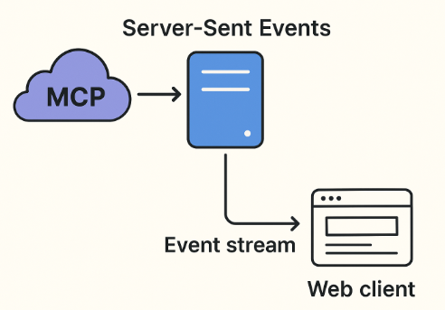

# DataPulseSSE — Lightweight MCP server over SSE (FastAPI)

A small, focused MCP (Model Context Protocol) server built with FastAPI that:
- Maintains a per-session SSE (Server‑Sent Events) stream
- Accepts MCP-style messages and emits results asynchronously via SSE
- Supports simple Bearer auth (local) and optional JWT verification (RS256)
- Ships with sample tools (get_time, fetch_url)

It runs locally (Uvicorn) and can be hosted on Azure Functions (via a small adapter).



## Table of contents
- Requirements
- Configuration
- Quick start (local)
- Authorization
- API endpoints
- Examples (curl)
- Browser client (EventSource)
- Data models
- Sessions and queues
- Built-in tools
- Run on Azure Functions
- Security and production notes
- Limitations / TODO

## Requirements
- Python 3.10+ 
- pip

## Configuration
Environment variables:
- LOCAL_BEARER_TOKEN — local Bearer token for dev (default: `secret_token`)
- JWT_ISSUER — optional, JWT RS256 issuer (OIDC issuer URL)
- JWT_AUDIENCE — optional, expected JWT audience
- JWT_KEY — optional, PEM public key used to verify RS256 tokens (if your auth code supports a static key)

Example (bash):
```bash
export LOCAL_BEARER_TOKEN="secret_token"
# Optional JWT (RS256) verification:
export JWT_ISSUER="https://login.microsoftonline.com/<tenant>/v2.0"
export JWT_AUDIENCE="api://your-app-id"
export JWT_KEY="$(cat public_key.pem)"
```

Note: For production-grade JWT verification against rotating keys, use JWKS discovery (preferred) instead of a static JWT_KEY.

## Quick start (local)

1) Install dependencies:
```bash
pip install -r requirements.txt
# If needed (not present in your requirements.txt):
pip install fastapi uvicorn
```

2) Run the server:
```bash
uvicorn app.main:app --reload
```

3) Open an SSE stream (in a new terminal):
```bash
# Use the same session_id for /events and /message
curl -N \
  -H "Authorization: Bearer ${LOCAL_BEARER_TOKEN:-secret_token}" \
  "http://localhost:8000/events?session_id=abc123"
```
Tip: `-N` disables buffering in curl, which is important for SSE.

## Authorization
- Local Bearer: send `Authorization: Bearer secret_token` (or your LOCAL_BEARER_TOKEN).
- JWT (RS256): if configured via environment variables, the server will validate `Authorization: Bearer <jwt>` and reject invalid tokens.

If no valid auth is provided, the server returns 401 Unauthorized.

## API endpoints

### GET /events
- Query: `session_id` (required)
- Headers: `Authorization: Bearer ...`
- Returns an SSE stream. Messages are sent as lines:
  ```
  data: {"type":"...","request_id":"...","data":{...}}

  ```
- Keep‑alive comments `: ping` are sent periodically when idle.

Status codes:
- 200 — stream opened
- 401 — unauthorized

### POST /message
- Query: `session_id` (required)
- Headers: `Authorization: Bearer ...`, `Content-Type: application/json`
- Body (MCP request):
```json
{
  "type": "list_tools" | "call_tool",
  "request_id": "req-123",
  "data": {
    "name": "get_time" | "fetch_url",
    "url": "https://example.com"
  }
}
```
Behavior:
- Validates the session (TTL ~1h)
- Processes the request and enqueues the result for that session
- Returns an acknowledgment (the actual result arrives on the SSE stream)

## Examples (curl)

List tools:
```bash
curl -X POST "http://localhost:8000/message?session_id=abc123" \
  -H "Authorization: Bearer ${LOCAL_BEARER_TOKEN:-secret_token}" \
  -H "Content-Type: application/json" \
  -d '{"type":"list_tools","request_id":"req-1","data":{}}'
```

Call get_time:
```bash
curl -X POST "http://localhost:8000/message?session_id=abc123" \
  -H "Authorization: Bearer ${LOCAL_BEARER_TOKEN:-secret_token}" \
  -H "Content-Type: application/json" \
  -d '{"type":"call_tool","request_id":"req-2","data":{"name":"get_time"}}'
```

Call fetch_url:
```bash
curl -X POST "http://localhost:8000/message?session_id=abc123" \
  -H "Authorization: Bearer ${LOCAL_BEARER_TOKEN:-secret_token}" \
  -H "Content-Type: application/json" \
  -d '{"type":"call_tool","request_id":"req-3","data":{"name":"fetch_url","url":"https://example.com"}}'
```

Example SSE event:
```
data: {"type":"tool_result","request_id":"req-2","data":{"time":"2025-08-31T12:00:00Z"}}
```

## Browser client (EventSource)
```html
<script>
  const sessionId = "abc123";
  const url = `http://localhost:8000/events?session_id=${encodeURIComponent(sessionId)}`;
  const es = new EventSource(url);

  es.onmessage = (e) => {
    console.log("SSE message:", e.data);
  };
  es.onerror = (e) => {
    console.warn("SSE error:", e);
  };
</script>
```

Important: browsers don’t allow custom headers in EventSource, so you can’t directly attach Authorization. For browser usage, place a gateway/proxy (e.g., APIM, reverse proxy) that terminates auth and forwards to the backend.

## Data models

MCPRequest (short):
```json
{"type":"list_tools|call_tool","request_id":"string","data":{...}}
```

MCPResponse:
```json
{"type":"list_tools|tool_result|error","request_id":"string","data":{...}}
```

ErrorResponse:
```json
{"type":"error","request_id":"string","error":"..."}
```

## Sessions and queues
- Sessions are stored in-process (TTL ~1h).
- Each session has its own message queue.
- Always use the same `session_id` for the SSE stream and the POST message.

## Built-in tools
- list_tools — returns the available tools
- get_time — returns current UTC time (ISO 8601, Z suffix)
- fetch_url(url) — fetches content from a URL (short timeout), returns HTTP status and a content snippet

## Run on Azure Functions
- The repo includes an adapter (e.g., `app/azure_adapter.py`) using Mangum to expose the FastAPI app on an Azure Functions HTTP trigger.
- In your Function App:
  - Configure the entry point to the adapter
  - Set environment variables as you do locally

## Security and production notes
- Prefer a gateway (e.g., Azure API Management) to handle OAuth/PKCE, rate limiting, and to inject backend keys.
- For JWT, favor JWKS discovery (rotating keys) over a static public key.
- SSE reliability: keep-alives are emitted; consider connection limits and proper cleanup.
- Observability: add structured logging and basic metrics (e.g., request counts, queue depth).
- Horizontal scaling: in-memory sessions won’t scale across instances; use a shared store (e.g., Redis) if needed.

## Limitations / TODO
- No full MCP Authorization flow (OAuth/PKCE with encrypted session keys)
- In-memory sessions/queues only (no cross-instance sharing)
- Minimal auth by default; JWT is optional and requires config
- No CI/test automation included by default
